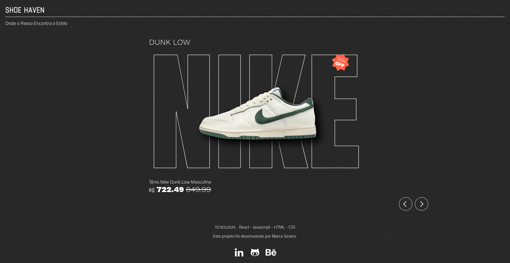

# Shoe Haven


Este projeto foi desenvolvido para simular o elemento hero em forma de carrossel, para uma loja virtual de tênis. Este componente permite exibir uma seleção de tênis em destaque.

### Funcionalidades
- Detalhes do Produto: Veja informações detalhadas sobre cada tênis, incluindo fabricante, título, preço e promoções.
- Experiência Responsiva: A interface do usuário é projetada para funcionar perfeitamente em dispositivos móveis e desktops.
- Responsividade: O carrossel é projetado para ser totalmente responsivo, garantindo uma experiência consistente em dispositivos móveis, tablets e desktops.
- Promoções Dinâmicas: Quando aplicável, as promoções são calculadas dinamicamente dentro do próprio componente, garantindo uma apresentação atualizada e precisa dos preços dos tênis em promoção.
- Orientação do Dispositivo: O OrientationDetectorDevice assegura que o carrossel seja exibido da melhor forma possível pois indica o usuário que é preciso girar a tela para visualizar o conteúdo


### Tecnologias Utilizadas
- React.js: Utilizado para a construção do componente carrossel e manipulação da interface do usuário.
- TypeScript: Linguagem de programação que adiciona tipagem estática ao JavaScript, proporcionando maior segurança e prevenindo erros durante o desenvolvimento.
- Vite: Um construtor de aplicações web que oferece uma experiência de desenvolvimento extremamente rápida e eficiente para projetos modernos em JavaScript, TypeScript, CSS e HTML.
- CSS Modules: Uma abordagem para escrever estilos CSS em arquivos modulares, garantindo o encapsulamento e a reutilização de estilos específicos de componentes.
- CSS3: Responsável pelo estilo e layout do carrossel, juntamente com o uso de CSS Modules, garantindo uma apresentação visualmente atraente e coesa.
- JavaScript: Implementa a lógica de navegação e exibição dos itens do carrossel, proporcionando uma experiência interativa para os usuários.
- slick-carousel: Uma biblioteca de carrossel responsivo e flexível para React, que proporciona uma experiência de navegação suave e interativa.
- eslint: Uma ferramenta de linting que ajuda a identificar e corrigir problemas no código JavaScript/TypeScript, mantendo um padrão de código consistente e de alta qualidade.


### 📝 Iniciando um projeto React com Vite
  
<details>
    <summary>Criar e configurar uma aplicação React usando o VITE</summary>

- [ ] Criar o diretório do projeto;
- [ ] Instalar o react usando o Vite ``npm create vite@latest`` ;
      obs: entrar na pasta mas nao instalar as dependencias. so fazer isso depois de instalr o eslint
- [ ] Alterar a chave ``dev`` do arquivo ``package.json``  ;

    ```bash

    "scripts": {
      "dev": "vite --open",
      "build": "vite build",
    },
    ```

</details>

<details>
    <summary>Configurar o ESLint</summary>

- [ ] excluir o arquivo de configuração de lint criado pelo vite com o comando:

    ```bash
    rm .eslintrc.cjs
    ```
- [ ] Remover as dependências que foram instaladas pelo Vite.

    ```bash
    npm remove @typescript-eslint/eslint-plugin @typescript-eslint/parser eslint-plugin-react-hooks eslint-plugin-react-refresh
    ```
- [ ] instalar o pacote de regras de lint com o padrão da Trybe.

    ```bash
    npm i @trybe/eslint-config-frontend -D
    ```

- [ ] Criar o arquivo ``.eslintrc.json`` na raiz do projeto com o seguinte conteúdo.

    ```bash
    //.eslintrc.json
    {
      "extends": "@trybe/eslint-config-frontend/typescript"
    }
    ```

- [ ] Editar o arquivo ``pakage.json`` adicionando o script para rodar o ESlint.

    ```bash
    //package.json
    ...
      "scripts": {
        ...
        "lint": "eslint -c .eslintrc.json . --ext .js,.jsx,.ts,.tsx"
        ...
      },
    ...
    ```

- [ ] Criar o arquivo de configuração do VSCode ``.vscode/settings.json`` na raiz do projeto.

    ```bash
    //.vscode/settings.json
    {
      "editor.formatOnSave": true,
      "editor.codeActionsOnSave": {
      "source.fixAll.eslint": true,
      "source.fixAll.stylelint": true,
  },
      "extensions.ignoreRecommendations": false,
  }
    ```
</details>
