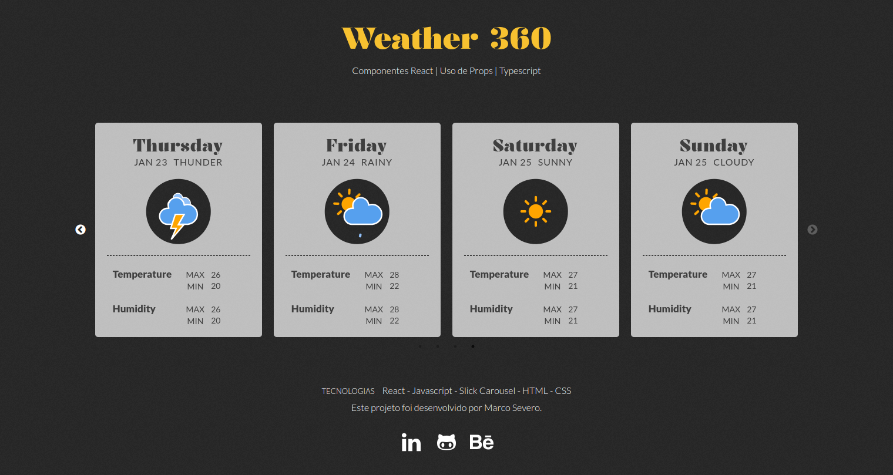

# Frontend Modelos

## Sobre a aplicação

Esta é uma aplicação desenvolvida em React, estruturada com TypeScript e construída com o Vite. O objetivo é simular um aplicativo de previsão do tempo, onde as informações são consumidas de um objeto para emular o comportamento de uma API.

### Dependências

- Para a criação do Slider usei a biblioteca [Slick Carousel](https://kenwheeler.github.io/slick/) como dependência.
- Além disso, para manter a consistência e qualidade do código, estou utilizando o ESLint.

### Importância

Exercitar o uso de TypeScript, Criação de componentes e passagem de Props

### Deploy da Aplicação

[Clique aqui](https://weather.severidade.com.br/) para verificar a versão final do projeto em seu navegador.