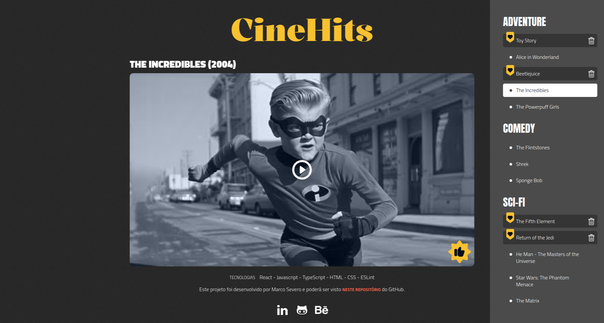

# CineHits

O CineHits é uma aplicação projetada para gerenciar uma lista fixa e pré-estabelecida de filmes. Esta lista é representada por um [objeto JSON](https://github.com/severidade/frontend_modelos/blob/movies/src/data/index.ts), simula o retorno de uma API. O objetivo da aplicação é permitir que o usuário gerencie a sua lista de favoritos. 

Neste primeiro momento, o gerenciamento da lista é feito com estado global, mas há planos para substituí-lo pelo Redux. A aplicação é responsiva, garantindo uma experiência consistente em diferentes dispositivos e tamanhos de tela.

[Deploy da aplicação](https://cine.severidade.com.br/)

### Funcionalidades
- Gerenciamento de Favoritos: Adiciona ou remove filmes dos favoritos.
- Listagem de Filmes: Navega por uma coleção fixa de filmes organizada em categorias.
- Reprodução de Vídeos: Exibe vídeos dos filmes selecionados ou uma miniatura com um botão de reprodução.

### Tecnologias Utilizadas
- React com Vite: CineHits utiliza React para a construção da interface do usuário e Vite como ferramenta de desenvolvimento e construção. Vite é um build tool moderno que melhora significativamente a experiência de desenvolvimento com React.
- TypeScript: Linguagem de programação que adiciona tipagem estática ao JavaScript.
- ESLint: Ferramenta de linting para garantir a qualidade do código, configurada com as regras da [Airbnb](https://github.com/airbnb/javascript/tree/master/packages/eslint-config-airbnb).
- React Player: Biblioteca para integrar e controlar players de vídeo.

### Roadmap de Melhorias
Com o objetivo de melhorar o gerenciamento de estado e a escalabilidade da aplicação, o CineHits passará por uma atualização já prevista, que é a substituição do gerenciamento de estado global atual pelo Redux, proporcionando uma abordagem mais robusta e escalável.